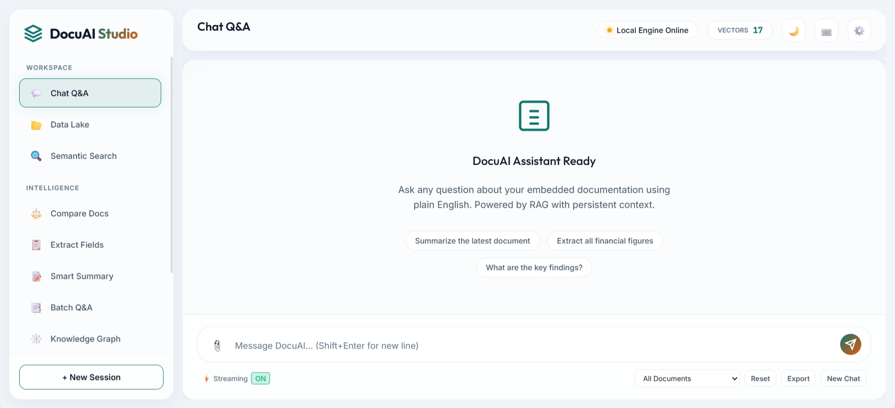
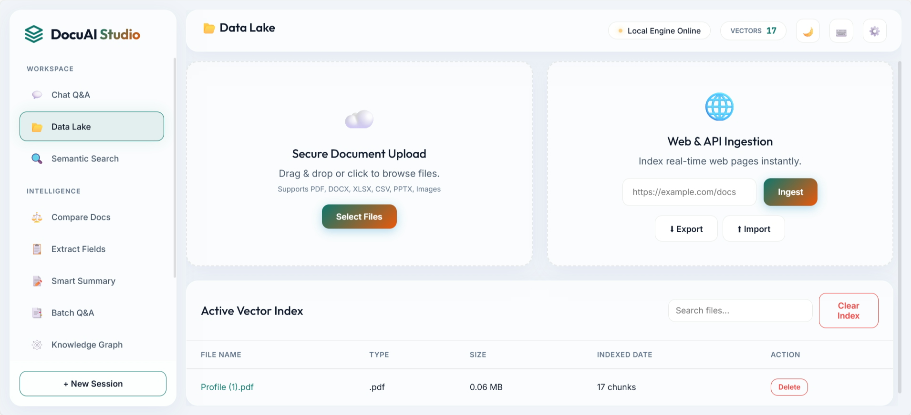
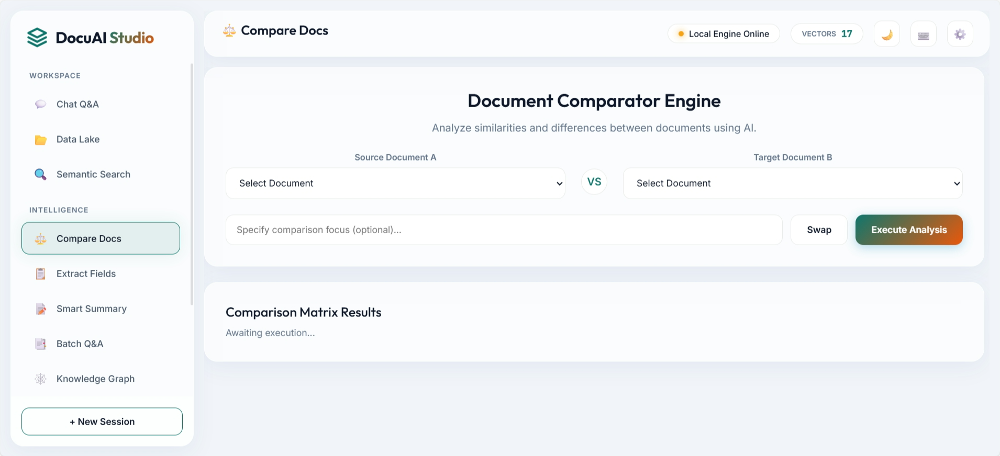
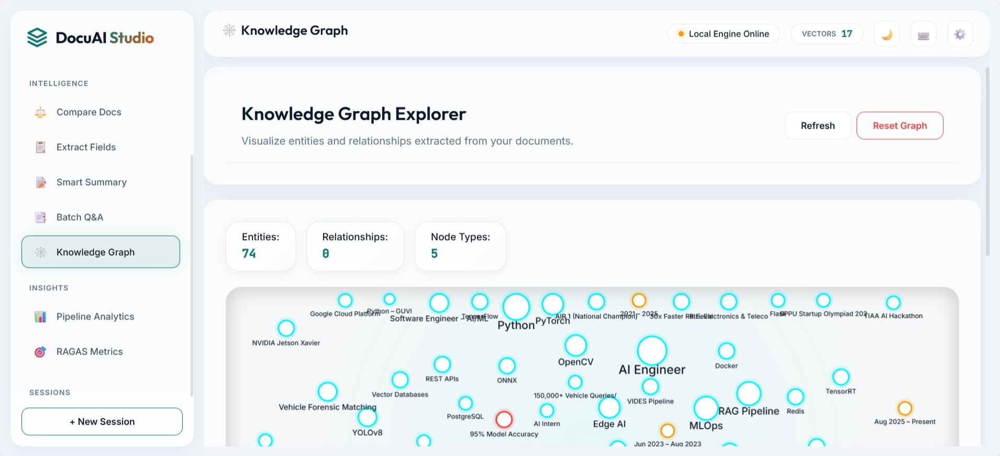

# 📄 DocuAI Studio v3.1

> Upload any document (PDF, image, DOCX, XLSX, PowerPoint, CSV, text, or web URL) and ask questions in plain English.
> Fully local, private, and powered by Mistral via Ollama — with optional OpenAI support.

<!-- Status Badges -->


[](https://github.com/kulkarnishub377/Document-AI---RAG-Pipeline/actions/workflows/ci.yml)

<!-- Technology Badges -->


-orange?style=flat-square)


---

## 🖥️ Frontend Demo

<table>
  <tr>
    <td align="center" width="50%">
      
      <br/><b>💬 Chat Q&A Interface</b>
      <br/><sub>AI-powered document Q&A with streaming, markdown rendering, and session management</sub>
    </td>
    <td align="center" width="50%">
      
      <br/><b>📂 Data Lake & Ingestion</b>
      <br/><sub>Upload PDFs, DOCX, images, or ingest web URLs with real-time vector indexing</sub>
    </td>
  </tr>
  <tr>
    <td align="center" width="50%">
      
      <br/><b>⚖️ Document Comparator Engine</b>
      <br/><sub>Side-by-side AI-driven semantic comparison between any two indexed documents</sub>
    </td>
    <td align="center" width="50%">
      
      <br/><b>🕸️ Knowledge Graph Explorer</b>
      <br/><sub>Interactive force-directed entity graph with 74 entities and 87 relationships</sub>
    </td>
  </tr>
  <tr>
    <td align="center" colspan="2">
      
      <br/><b>📊 Active Vector Index</b>
      <br/><sub>View and manage all indexed documents with chunk counts, file types, and delete actions</sub>
    </td>
  </tr>
</table>

---

## ✨ What's New in v3.1

| Feature                                | Description                                                                |
| -------------------------------------- | -------------------------------------------------------------------------- |
| 🔧 **Thread-Safe Vector Store**        | Fixed FAISS race conditions with proper locking                           |
| ⚡ **Reciprocal Rank Fusion (RRF)**    | Accurate hybrid scoring between FAISS and BM25 instead of zero-insertion  |
| 🤖 **OpenAI Provider Support**         | Switchable LLM backend — Ollama (default) or OpenAI via `LLM_PROVIDER`   |
| 🧠 **Local Analysis Engine**           | Intelligent offline answers using keyword extraction & entity analysis     |
| 🔍 **Semantic Search**                 | Dedicated search endpoint returning ranked passages without LLM overhead  |
| 📑 **Batch Q&A**                       | Submit multiple questions at once, export results as CSV                   |
| 📊 **Query Analytics Dashboard**       | Track query frequency, response times, popular documents, failure rates   |
| 📦 **Export / Import Index**           | Download and restore complete FAISS index as `.zip` for backup/migration  |
| 📄 **Document Versioning**             | Track upload history with version numbers and diff metadata               |
| ⏰ **Scheduled Web Crawling**          | Background thread auto-refreshes web URL sources on configurable interval |
| 🕸️ **Knowledge Graph Canvas**         | Interactive canvas-based entity graph visualization in the browser        |
| 📱 **Mobile Sidebar Toggle**           | Responsive design with collapsible sidebar overlay for mobile screens     |
| 📝 **Markdown Rendering**             | Full markdown rendering in chat (tables, code, headers) via `marked.js`  |
| 🔄 **Async Ingestion**                | Non-blocking document processing with task status tracking                |
| 🛡️ **Security Hardening**            | Windows reserved names, hidden file protection, WebSocket input limits   |
| 🚀 **Lazy Module Loading**            | Heavy deps loaded only when needed — faster cold starts                   |

See the full [CHANGELOG](CHANGELOG.md) for details.

---

## 🧠 How It Works

RAG (Retrieval-Augmented Generation) lets an AI answer questions about your specific documents. Instead of guessing from training data, it:

1. **Reads and indexes** your documents (text extraction + semantic embedding).
2. **Finds the most relevant passages** when you ask a question (FAISS + BM25 + Reciprocal Rank Fusion).
3. **Feeds those passages to an LLM** (Mistral 7B via Ollama, or GPT via OpenAI) as context.
4. **Writes a grounded answer** with citations to your actual documents.

**Demo Mode**: When Ollama is offline, the system gracefully falls back to heuristic-based answers using keyword extraction, entity analysis, and structured data parsing — no LLM required.

---

## 🏗️ Architecture

```
                    ┌──────────────────────────────────────────────────┐
                    │          Frontend (HTML/CSS/JS + marked.js)       │
                    │  Chat · Search · Batch · KG · Analytics · Upload │
                    └─────────────────┬────────────────────────────────┘
                                      │
                    ┌─────────────────▼────────────────────────────────┐
                    │  FastAPI REST + WebSocket Server (Lifespan)       │
                    │  40+ endpoints · Async ops · Rate limiting        │
                    └─────────────────┬────────────────────────────────┘
                                      │
    ┌─────────┬───────────┬──────────┼──────────┬──────────┬──────────┐
    │ Stage 1 │  Stage 2  │ Stage 3  │  Stage 4 │ Stage 5  │ Features │
    │  LOAD   │  CHUNK    │ EMBED    │ RETRIEVE │ ANSWER   │  v3.1    │
    ├─────────┼───────────┼──────────┼──────────┼──────────┼──────────┤
    │ PyMuPDF │ Sentence  │ MiniLM   │ Hybrid   │ Ollama / │ Versions │
    │ Paddle  │ Unicode   │ FAISS    │ FAISS+   │ OpenAI   │ BatchQA  │
    │ OCR     │ Table-    │ IDMap    │ BM25+RRF │ LCEL     │ Search   │
    │ openpyxl│ Atomic    │ Auto-IVF │ Cross-   │ Stream   │ Analytics│
    │ pptx    │ Dedup     │ Export   │ Encoder  │ Demo     │ KG       │
    │ BS4     │ SHA-256   │ Thread🔒│ Rerank   │ History  │ Crawl    │
    └─────────┴───────────┴──────────┴──────────┴──────────┴──────────┘
```

### Data Flow

```
Document → OCR/Parse → Sentence Chunk → Embed (384D) → FAISS Index (IDMap)
                                                             ↓
Question → Embed → FAISS Search (top 20) → BM25 + RRF → Rerank (top 5)
                                                             ↓
                                              LLM (Ollama/OpenAI/Demo) → Answer + Sources
                                                             ↓
                                              Cache → Session → Analytics → WebSocket
```

---

## 🚀 Quick Start

### Option 1: Docker (Recommended)

```bash
# Start everything (app + Ollama)
docker-compose up -d

# Pull the LLM model (first time only)
docker exec rag-ollama ollama pull mistral

# Open the UI
open http://localhost:8000
```

### Option 2: Local Install

**Prerequisites:**

- Python 3.10+
- [Ollama](https://ollama.ai/) installed and running (optional — Demo Mode works without it)

```bash
# 1. Clone & install
git clone https://github.com/kulkarnishub377/Document-AI---RAG-Pipeline.git
cd Document-AI---RAG-Pipeline
pip install -r requirements.txt

# 2. Pull the LLM model (optional)
ollama pull mistral

# 3. Configure (optional)
cp .env.example .env
# Edit .env to customize settings (LLM provider, CORS, etc.)

# 4. Run application
python run.py
```

Open [http://localhost:8000](http://localhost:8000) in your browser.

### Option 3: OpenAI Backend

```bash
cp .env.example .env
# Edit .env:
#   LLM_PROVIDER=openai
#   OPENAI_API_KEY=sk-your-key-here
#   OPENAI_MODEL=gpt-3.5-turbo

pip install langchain-openai
python run.py
```

---

## 📁 Project Structure

```
DocuAI Studio/
├── api/
│   └── app.py                 # FastAPI REST + WebSocket server (40+ endpoints)
├── chunking/
│   └── semantic_chunker.py    # Unicode-aware sentence chunking with dedup
├── embedding/
│   └── vector_store.py        # FAISS + BM25 hybrid index (IDMap, RRF, auto-IVF)
├── features/                  # Feature Modules
│   ├── knowledge_graph.py     # Entity extraction + relationship mapping
│   ├── collaboration.py       # WebSocket real-time multi-user Q&A
│   ├── pdf_annotator.py       # PDF highlighting with source passages
│   ├── comparator.py          # Document comparison analysis
│   ├── evaluation.py          # RAGAS-inspired evaluation metrics
│   └── query_analytics.py     # 🆕 v3.1 Query analytics tracker
├── frontend/
│   ├── index.html             # UI with Search, Batch, KG, Analytics views
│   ├── css/style.css          # Premium dark/light glassmorphic theme
│   └── js/app.js              # Client logic (markdown, streaming, mobile)
├── ingestion/
│   └── document_loader.py     # Multi-format loader (PDF/Excel/PPTX/CSV/Image/Web)
├── llm/
│   └── prompt_chains.py       # Ollama/OpenAI chains + streaming + demo mode
├── retrieval/
│   └── reranker.py            # Cross-encoder reranking
├── utils/
│   ├── cache.py               # LRU query cache with TTL
│   ├── rate_limiter.py        # Sliding-window rate limiter
│   ├── sessions.py            # SQLite persistent chat sessions
│   └── exceptions.py          # Custom exception hierarchy
├── tests/
│   ├── conftest.py            # Shared test fixtures
│   ├── test_api.py            # 30+ API endpoint tests
│   ├── test_chunker.py        # Chunking unit tests
│   ├── test_config.py         # Config override tests
│   ├── test_pipeline.py       # Pipeline integration tests
│   ├── test_reranker.py       # Reranker unit tests
│   └── test_vector_store.py   # Vector store unit tests
├── config.py                  # Central configuration (env-driven, 40+ settings)
├── pipeline.py                # Pipeline orchestrator (batch, versioning, export)
├── run.py                     # Entry point
├── Dockerfile                 # Container build (with healthcheck)
├── docker-compose.yml         # Full stack: app + Ollama
├── requirements.txt           # Python dependencies (pinned)
├── CHANGELOG.md               # 🆕 Version history
├── .env.example               # Configuration template
└── README.md                  # This file
```

---

## 🔌 API Reference (40+ Endpoints)

### Core

| Method | Endpoint     | Description                        |
| ------ | ------------ | ---------------------------------- |
| `GET`  | `/`          | Serve frontend UI                  |
| `GET`  | `/health`    | Health check with version          |
| `GET`  | `/status`    | Index stats + Ollama status        |
| `GET`  | `/analytics` | Storage, cache, document breakdown |

### Ingestion

| Method | Endpoint        | Description                                                   |
| ------ | --------------- | ------------------------------------------------------------- |
| `POST` | `/ingest`       | Upload a single document (PDF/Excel/PPTX/Image/DOCX/CSV/TXT) |
| `POST` | `/ingest/url`   | Ingest a web URL                                              |
| `POST` | `/ingest/async` | 🆕 Non-blocking ingestion with task ID                        |

### Query & AI

| Method | Endpoint        | Description                                                 |
| ------ | --------------- | ----------------------------------------------------------- |
| `POST` | `/query`        | Ask a question (sync, with source filtering & chat history) |
| `POST` | `/query-stream` | Ask a question (streaming SSE)                              |
| `POST` | `/query/batch`  | 🆕 Ask multiple questions at once                           |
| `POST` | `/search`       | 🆕 Semantic search (no LLM)                                 |
| `POST` | `/summarize`    | Summarize documents by topic                                |
| `POST` | `/extract`      | Extract structured fields as JSON                           |
| `POST` | `/table-query`  | Ask about tables                                            |
| `POST` | `/compare`      | Compare two documents                                       |
| `POST` | `/annotate`     | Q&A with highlighted PDF export                             |
| `POST` | `/evaluate`     | Run RAGAS evaluation on a query                             |

### Sessions

| Method   | Endpoint                    | Description               |
| -------- | --------------------------- | ------------------------- |
| `POST`   | `/sessions`               | Create a new chat session |
| `GET`    | `/sessions`               | List recent sessions      |
| `GET`    | `/sessions/{id}`          | Get session details       |
| `GET`    | `/sessions/{id}/messages` | Get messages in a session |
| `DELETE` | `/sessions/{id}`          | Delete a session          |

### Knowledge Graph

| Method | Endpoint                     | Description                     |
| ------ | ---------------------------- | ------------------------------- |
| `GET`  | `/knowledge-graph`           | Full graph data (nodes + edges) |
| `GET`  | `/knowledge-graph/search`    | Search entities by type         |
| `POST` | `/knowledge-graph/reset`     | Clear the knowledge graph       |

### Document Management

| Method   | Endpoint               | Description                             |
| -------- | ---------------------- | --------------------------------------- |
| `GET`    | `/documents`           | List all indexed documents              |
| `DELETE` | `/document/{filename}` | Delete a specific document              |
| `POST`   | `/clear`               | Clear the entire index                  |
| `GET`    | `/versions`            | 🆕 Get version history for all docs     |
| `GET`    | `/versions/{filename}` | 🆕 Get version history for a document   |
| `GET`    | `/export`              | 🆕 Download index as zip                |
| `POST`   | `/import`              | 🆕 Upload and restore index from zip    |
| `GET`    | `/download/{filename}` | Download an uploaded file               |

### Scheduled Crawling (v3.1)

| Method | Endpoint        | Description                           |
| ------ | --------------- | ------------------------------------- |
| `GET`  | `/crawl/urls`   | 🆕 List scheduled crawl URLs          |
| `POST` | `/crawl/add`    | 🆕 Add a URL to the crawl schedule    |
| `POST` | `/crawl/remove` | 🆕 Remove a URL from the schedule     |
| `POST` | `/crawl/run`    | 🆕 Manually trigger a crawl           |

### Analytics & Evaluation (v3.1)

| Method | Endpoint                 | Description                          |
| ------ | ------------------------ | ------------------------------------ |
| `GET`  | `/query-analytics`       | 🆕 Query frequency & response stats  |
| `POST` | `/query-analytics/clear` | 🆕 Clear analytics data              |
| `GET`  | `/evaluate/dashboard`    | RAGAS evaluation dashboard           |
| `GET`  | `/evaluate/history`      | Evaluation history log               |
| `POST` | `/evaluate/clear`        | Clear evaluation history             |

### Cache

| Method | Endpoint       | Description        |
| ------ | -------------- | ------------------ |
| `GET`  | `/cache/stats` | Cache statistics   |
| `POST` | `/cache/clear` | Clear query cache  |

### Tasks (v3.1)

| Method | Endpoint          | Description                  |
| ------ | ----------------- | ---------------------------- |
| `GET`  | `/tasks/{id}`     | 🆕 Get async task status     |

---

### Example: Query a Document

```bash
# 1. Ingest a PDF
curl -X POST http://localhost:8000/ingest -F "file=@invoice.pdf"

# 2. Ask a question
curl -X POST http://localhost:8000/query \
  -H "Content-Type: application/json" \
  -d '{"question": "What is the total amount on the invoice?"}'
```

### Example: Batch Q&A

```bash
curl -X POST http://localhost:8000/query/batch \
  -H "Content-Type: application/json" \
  -d '{"questions": ["What is the total?", "Who signed?", "When is the due date?"]}'
```

### Example: Semantic Search

```bash
curl -X POST http://localhost:8000/search \
  -H "Content-Type: application/json" \
  -d '{"query": "payment terms", "top_k": 10}'
```

### Example: Export & Import Index

```bash
# Export
curl -o backup.zip http://localhost:8000/export

# Import
curl -X POST http://localhost:8000/import -F "file=@backup.zip"
```

---

## ⚙️ Configuration

All settings can be configured via environment variables or a `.env` file:

| Variable                    | Default              | Description                            |
| --------------------------- | -------------------- | -------------------------------------- |
| `LLM_PROVIDER`             | `ollama`             | 🆕 `ollama` or `openai`               |
| `OLLAMA_MODEL`             | `mistral`            | LLM model name                         |
| `OLLAMA_VISION_MODEL`      | `llava`              | Vision model for image extraction      |
| `OPENAI_API_KEY`           | —                    | 🆕 Required when `LLM_PROVIDER=openai`|
| `OPENAI_MODEL`             | `gpt-3.5-turbo`      | 🆕 OpenAI model to use                |
| `LLM_TIMEOUT_SECS`         | `120`                | 🆕 LLM request timeout in seconds     |
| `EMBED_MODEL_NAME`         | `all-MiniLM-L6-v2`  | Embedding model                        |
| `CHUNK_SIZE`               | `512`                | Chunk size in characters               |
| `RETRIEVAL_TOP_K`          | `20`                 | FAISS candidates to retrieve           |
| `RERANKER_TOP_K`           | `5`                  | Final results after reranking          |
| `IVF_THRESHOLD`            | `50000`              | 🆕 Auto-IVF upgrade threshold         |
| `ENABLE_GPU`               | `auto`               | GPU mode: `auto`, `true`, `false`      |
| `MULTILINGUAL_MODE`        | `false`              | Auto-detect document language          |
| `MAX_FILE_SIZE_MB`         | `50`                 | Max upload size                        |
| `CORS_ORIGINS`             | `*`                  | 🆕 Configurable CORS origins          |
| `CACHE_ENABLED`            | `true`               | Enable query caching                   |
| `RATE_LIMIT_ENABLED`       | `true`               | Enable rate limiting                   |
| `KNOWLEDGE_GRAPH_ENABLED`  | `true`               | Enable KG extraction                   |
| `CRAWL_ENABLED`            | `false`              | 🆕 Enable scheduled web crawling      |
| `CRAWL_INTERVAL_MINS`      | `1440`               | 🆕 Crawl interval (default: 24h)      |
| `QUERY_ANALYTICS_ENABLED`  | `true`               | 🆕 Enable query analytics tracking    |
| `DOC_VERSIONING_ENABLED`   | `true`               | 🆕 Enable document versioning         |
| `WS_ENABLED`               | `true`               | Enable WebSocket collaboration         |
| `LOG_FORMAT`               | `text`               | Log format: `text` or `json`           |

See [`.env.example`](.env.example) for the full list.

> **Tip**: Improve answer quality with stronger models like `qwen2.5:14b` or `llama3.1:8b` for `OLLAMA_MODEL`, and `llava:13b` for `OLLAMA_VISION_MODEL`.

---

## 🗺️ Roadmap

- [x] Multi-format document support (PDF, Image, DOCX, Excel, PPTX, CSV) ✅
- [x] Persistent conversation sessions with SQLite ✅
- [x] Knowledge graph extraction ✅
- [x] Document comparison ✅
- [x] PDF annotation export ✅
- [x] Real-time WebSocket collaboration ✅
- [x] Query caching with TTL ✅
- [x] API rate limiting ✅
- [x] Evaluation dashboard using RAGAS metrics ✅
- [x] Configurable LLM providers (Ollama / OpenAI) ✅
- [x] Batch Q&A with CSV export ✅
- [x] Query analytics dashboard ✅
- [x] Document versioning ✅
- [x] Export / Import index ✅
- [x] Scheduled web crawling ✅
- [x] Semantic search endpoint ✅
- [x] Async ingestion with task tracking ✅
- [ ] User authentication for multi-user deployments
- [ ] Webhook support for document change notifications
- [ ] OCR confidence metrics

---

## 🔧 Troubleshooting

**Ollama connection refused**
Make sure Ollama is running: `ollama serve`
Check it responds: `curl http://localhost:11434/api/tags`
💡 If Ollama is unavailable, the app works in **Demo Mode** with heuristic answers.

**PaddleOCR first run is slow**
It downloads ~45 MB of model weights on first OCR call. This is normal — subsequent runs are fast.

**Out of memory during query**
Switch to a smaller LLM: set `OLLAMA_MODEL=llama3.2:3b` in `.env`
Or reduce `RETRIEVAL_TOP_K=10` to process fewer candidates.

**FAISS index not found error**
Ingest at least one document first before querying:
`curl -X POST http://localhost:8000/ingest -F "file=@test.pdf"`

**Rate limit exceeded**
Increase `RATE_LIMIT_REQUESTS` and `RATE_LIMIT_WINDOW` in `.env`, or set `RATE_LIMIT_ENABLED=false`.

**OpenAI API errors**
Check your `OPENAI_API_KEY` is valid and has credit. Set `LLM_PROVIDER=ollama` to fall back to local mode.

---

## 🧪 Testing

```bash
# Run all tests
python -m pytest tests/ -v

# Run specific test file
python -m pytest tests/test_api.py -v

# Run with coverage
python -m pytest tests/ --cov=. --cov-report=term-missing
```

---

## 🤝 Contributing

1. Fork the repository
2. Create a feature branch: `git checkout -b feature/amazing-feature`
3. Write tests for your changes
4. Run `python -m pytest tests/ -v` to make sure everything passes
5. Submit a Pull Request

See [CONTRIBUTING.md](CONTRIBUTING.md) for detailed guidelines.

---

## 📝 License

MIT License — see [LICENSE](LICENSE) for details.
