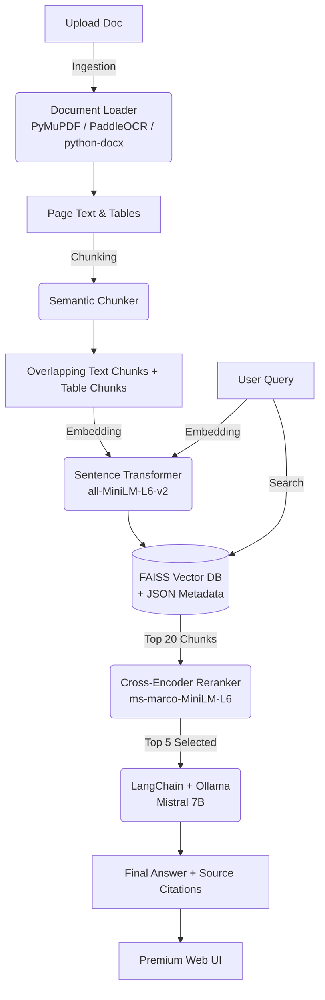

# Document AI + RAG Pipeline 🧠📄

A production-ready, locally-hosted Retrieval-Augmented Generation (RAG) system for chatting with your documents. It uses semantic search to find relevant information in your uploaded files and an offline Large Language Model (Mistral via Ollama) to answer your questions with precise source citations.


## ✨ Features

- **100% Private:** Runs entirely on your local machine. No data leaves your system. No API costs.
- **Multi-Format Ingestion:** Supports PDF, DOCX, TXT, MD, and scanned images (PNG, JPG, TIFF) via PaddleOCR.
- **Table Extraction:** Preserves table structure during chunking, enabling you to ask quantitative questions about tabular data.
- **Semantic Caching & Reranking:** Uses `all-MiniLM-L6-v2` for dense FAISS vector search, followed by `ms-marco-MiniLM-L6-v2` cross-encoder reranking for supreme retrieval accuracy.
- **Four Purpose-Built Modes:**
  - 💬 **Q&A:** Ask general questions, get answers with page citations.
  - 📋 **Summarize:** Instantly condense large sections of documents by topic.
  - 🔧 **Extract:** Pull specific fields (e.g., invoice numbers, dates) into clean JSON.
  - 📊 **Table Q&A:** Specifically interrogate tabular data isolated from surrounding text.
- **Beautiful Frontend:** Premium dark-themed, glassmorphic UI with drag-and-drop file upload, real-time progress, and conversation history.

---

## 🏗️ Architecture



---

## 🚀 Getting Started

### 1. Prerequisites

You must have **Python 3.10+** installed. Additionally, you need **Ollama** to run the local LLM.

*   Download and install Ollama from [ollama.com](https://ollama.com).

### 2. Model Downloads

You need to pull the language model using Ollama. Open a new terminal and run:

```bash
ollama pull mistral
```
*(This will download a ~4GB, highly capable 7B parameter model. You only need to do this once.)*

Make sure the Ollama server is running in the background:
```bash
ollama serve
```

### 3. Setup Python Environment

Open a terminal in the project directory:

```bash
# 1. Create a virtual environment
python -m venv venv

# 2. Activate it (Windows)
.\venv\Scripts\activate
# (Mac/Linux: source venv/bin/activate)

# 3. Install dependencies
pip install -r requirements.txt
```

*(Note: The first time you run the pipeline, it will automatically download two small NLP models for embedding and reranking — roughly 170MB combined. They will be cached in `~/.cache/huggingface/`.)*

### 4. Configuration (Optional)

Copy `.env.example` to a new file named `.env`. Here you can override settings like `MAX_FILE_SIZE_MB`, models used, and network ports.
```bash
cp .env.example .env
```

---

## 💻 Running the App

### Start the Backend + Frontend server:

```bash
python run.py
# Or directly: uvicorn api.app:app --host 0.0.0.0 --port 8000
```

Open your browser and navigate to: **http://localhost:8000**

You can now drag and drop a document into the UI and start asking questions!

---

## 🛠️ Project Structure

The codebase is organized into modular packages:

```text
Document AI/
├── api/                  # FastAPI web application endpoints (Backend)
│   └── app.py
├── chunking/             # Text and table slicing logic
│   └── semantic_chunker.py
├── data/                 # Local storage (gitignored)
│   ├── index/            # FAISS vector DB and metadata.json
│   ├── uploads/          # Uploaded source files
│   └── pipeline.log
├── embedding/            # Dense vector search logic
│   └── vector_store.py
├── frontend/             # Premium UI static files
│   ├── index.html
│   ├── css/style.css
│   └── js/app.js
├── ingestion/            # File loaders (PDF, OCR, Docx)
│   └── document_loader.py
├── llm/                  # Langchain prompt chains using Ollama
│   └── prompt_chains.py
├── retrieval/            # Cross-encoder reranking
│   └── reranker.py
├── tests/                # Unit test suite
├── config.py             # Central configuration & .env loader
├── pipeline.py           # Core orchestrator script
├── requirements.txt      # Pinned pip dependencies
└── pyproject.toml        # Modern Python package metadata
```

---

## 💻 API Usage (Headless)

You can interact with the FastAPI backend programmatically. See the interactive docs at `http://localhost:8000/docs`.

**Ingest a Document:**
```bash
curl -X POST http://localhost:8000/ingest -F "file=@sample_invoice.pdf"
```

**Query Information:**
```bash
curl -X POST http://localhost:8000/query \
     -H "Content-Type: application/json" \
     -d '{"question": "What is the total amount due?"}'
```
*Response:*
```json
{
  "answer": "The total amount due is $1,450.00.",
  "sources": [
    {
      "source": "sample_invoice.pdf",
      "page": 1,
      "excerpt": "Total Amount Due: $1,450.00\nPlease pay within 30 days."
    }
  ]
}
```

---

## 🤝 Contributing

1. Fork the repository
2. Create your feature branch (`git checkout -b feature/amazing-feature`)
3. Run formatting and tests
4. Commit your changes (`git commit -m 'Add amazing feature'`)
5. Push to the branch (`git push origin feature/amazing-feature`)
6. Open a Pull Request

## 📜 License

Distributed under the MIT License. See `LICENSE` for more information.
